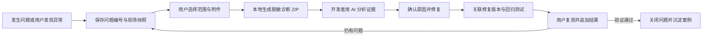
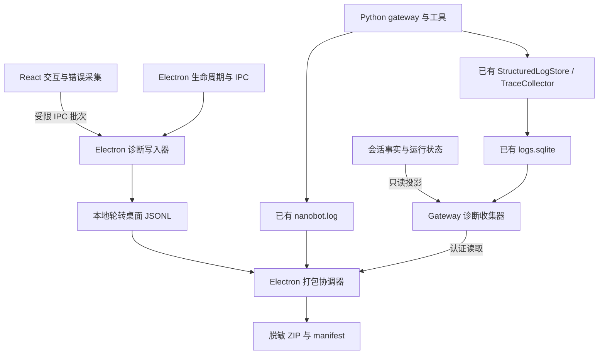

# TPCowork 日志与问题诊断闭环设计

状态：关键过程统一记录、本地诊断 ZIP、安全错误原因链、日志刷新确认、失败事件技术快照、本地只读体检和确定性执行摘要已实现；远程上传及自动修复案例管理仍为设计。代码核查日期：2026-09-08。

已实施范围：桌面结构化事件和 gateway 有界异步操作写入器贯通启动/请求/聊天身份，覆盖 HTTP、WS、Turn、LLM/Tool Trace、MCP、PPT 和产物发布。本地 ZIP 包含导出时前后端状态、失败事件技术快照、错误原因链、事件/Trace、安全事件、来源完整性、写入确认序号、体检结果、带证据引用的执行摘要和 AI 阅读说明。Electron 构建记录唯一身份并生成 source maps；gateway 操作日志增加会话/进程分区的字节和条数预算。帮助与设置均使用统一导出入口。没有自动上传或正文附件；旧文本日志仅导出保守技术摘要。具体容量、现场覆盖及实现限制以 README 为准。

本轮借鉴 ruyi 的错误上下文、队列刷新、环形缓冲、doctor 接入和离线执行还原思路，保留 Electron/Python 的现有执行边界。失败快照随现有日志保留，缓存界面状态与故障发生时间分别标注；不补造历史现场。体检不验证外网、凭证有效性或字体渲染。执行摘要由确定性代码生成，不自动推断根因或宣称已修复。

目标：用户遇到问题后，在客户端导出一个诊断 ZIP；开发者和 AI 可以还原操作过程、区分故障所在层、引用证据提出修复，并通过同一问题编号记录复测结果。

本文基于现有 [统一 Run Trace 设计](unified-run-trace-and-state-read-model-spec.md) 和 [项目存储设计](project-isolation-storage-spec.md) 补充桌面采集、诊断包和反馈闭环。会话事实源、Agent 执行权威仍在 nanobot。

## 1. 初始基线与设计动机（历史核查）

本节保留改造前的问题记录，不代表当前缺口；当前已实施能力以上文和 README 为准，其余章节是完整目标设计。

| 已有能力 | 代码位置 | 当前限制 |
| --- | --- | --- |
| 启动日志、Python 子进程状态、轮转 | `electron/startupLog.ts`、`electron/pythonBridge.ts` | 主要覆盖启动与 gateway 生命周期，不能代表所有 Electron 操作 |
| Python INFO 及以上文件日志 | `../nanobot/nanobot/utils/desktop_logging.py` | 文本日志与结构化 Trace 分开；文件 sink 本身没有统一脱敏处理 |
| 启动诊断窗口 | `src/components/sidebar/NanobotDiagnosticsDialog.tsx` | 连点品牌 5 次进入；复制文本、打开日志文件，没有综合诊断包 |
| 诊断快照 | `electron/pythonBridge.ts#getDiagnostics` | 每个日志只读最多 96 KiB 尾部；进程输出缓冲最多 500 行、120,000 字符，不汇总轮转归档 |
| 结构化日志、安全审计 | `../nanobot/nanobot/storage/logs.py` | 有 project/session/turn/trace/tool 等字段；常规日志查询最多 500 条，缺少面向导出的时间范围和游标 |
| Trace / Run / Span、上下文清单 | `../nanobot/nanobot/observability/`、`runtime/trace_context.py` | 已覆盖 Turn、LLM、Tool 等主路径，需补桌面交互、网络重连、业务内部阶段并统一导出 |
| 会话运行状态、投影水位 | `../nanobot/nanobot/webui/ws_http.py` | 已有 runtime diagnostics API，但没有与 GUI 当时看到的状态一起采集 |
| MCP 连接诊断 | `../nanobot/nanobot/runtime/mcp_diagnostics.py` | 每个连接最多 40 条历史、整体最多 256 个条目，保存在进程内存，重启会丢失 |
| React 错误边界 | `src/components/common/ErrorBoundary.tsx` | `componentDidCatch` 只写控制台，未接持久化诊断 |
| 意见反馈中的“上传日志” | `src/components/settings/SettingsView.tsx`、`src/core/prompthubApi.ts` | 客户端只发送 `includeLogs` 布尔值和反馈、图片、平台，没有收集或上传本地日志字节 |

补充核查结论：

- 当前 GUI 主入口未找到统一的未处理异常、Promise rejection、renderer 崩溃和无响应采集。
- `logs.sqlite` 已同时承载普通日志、安全审计和 Trace 表，不再创建另一套 Trace 数据库。
- `StructuredLogStore.write()` 会处理 `details` 中的部分敏感键，但 `message` 和普通字符串值没有同等保护；各处脱敏规则也不一致，不能直接把原始数据库或日志交给用户外发。
- 现有 Trace 导出经过通用脱敏器，数组最多保留 200 项。综合诊断包需要独立的完整性标记和有界分页，不能把这种截断当成完整执行链路。
- `StructuredLogStore.prune()` 已定义，但本次全仓搜索未发现普通日志清理调用；Trace 和安全审计有各自清理逻辑。新增采集量前需补上容量和清理监控。

## 2. 用户流程



入口统一放在“帮助与反馈”，操作为“导出诊断包”和“记录一次问题”。聊天错误、PPT 导出失败、MCP 连接失败处提供带当前任务范围的同一入口。原始日志查看保留为次级功能。

导出界面只需要：

| 字段 | 默认行为 |
| --- | --- |
| 问题描述 | 从错误入口带入现象；允许补充预期、实际结果和复现步骤 |
| 发生时间 | 当前问题发生时间，可选择更早的时间 |
| 范围 | 错误入口选当前任务；帮助页选最近 15 分钟，可选 1 小时、24 小时 |
| 技术诊断 | 默认包含脱敏事件、版本、运行环境和状态摘要 |
| 本次对话片段 | 默认不包含，用户可选择具体轮次并预览 |
| 截图或生成文件 | 默认不包含，由用户主动选择和预览 |
| 结果 | 显示文件大小、包含项、缺失项、问题编号，保存 ZIP 并可打开所在目录 |

流程状态为 `idle -> collecting -> redacting -> packaging -> ready / partial / failed / cancelled`。部分来源读取失败时仍可导出，并明确显示缺失来源；不能展示“完整诊断”却只有启动日志。

“记录一次问题”在没有 ERROR 的情况下也能创建现场快照，用于卡顿、内容不完整、PPT 排版差、按钮无反应等问题。生成质量问题需要样稿、模板版本、字体与渲染环境；仅凭异常日志不能判断视觉好坏。

第一版交付本地 ZIP。之后可让现有意见反馈附带这个 ZIP；远程接收服务的附件接口、认证、大小限制和存储策略需独立对接。导出不调用模型、不要求联网或登录，也不自动发送反馈。

## 3. 采集与存储分工



- Renderer 只上报有类型、有限长度的诊断事件；不直接写文件、访问 SQLite、枚举整个 Zustand store 或重新执行业务操作。
- Electron 持有桌面日志、现场摘要和 ZIP 导出协调。受限 IPC 校验 sender、事件类型、字段、批次大小和频率；渲染器不能提供任意待打包目录。
- Gateway 持有自身日志 schema、会话/任务范围校验及诊断投影，沿用现有 TraceCollector。UI 事件可通过既有 ID 关联，无需把所有桌面日志再复制进 SQLite。
- 桌面 JSONL 是诊断副本，不能用于恢复会话业务状态。nanobot 会话 journal、state projection、调度权威保持现有分工。
- 此处将旧存储设计中“优先转发 Electron 日志”的建议细化为本地持久化优先、导出时汇总，避免日志可用性依赖 gateway 和产生重复写入。

## 4. 统一关联字段

扩展现有身份，不替换 `trace_id / run_id / span_id / turn_id / runtime_epoch`。

| 字段 | 生成方与含义 |
| --- | --- |
| `app_launch_id` | Electron 每次启动生成，关联本次启动中的所有进程 |
| `process_instance_id`、`process_seq` | 每个进程实例和本地递增序号，区分 renderer 重载、gateway 重启 |
| `client_action_id` | GUI 的一次发送、导出、设置保存等明确操作；非任务操作也可关联 |
| `request_id`、`attempt` | 每次 IPC/HTTP/WS 请求及重试次数，关联同一操作下的多次尝试 |
| `trace_id / run_id / span_id` | 复用 gateway 已有执行链路；未建立关联时保留空值 |
| `project_id / session_id / turn_id` | 复用权威资源身份；旧 session key 与 session ID 显式映射，不能混用 |
| `tool_call_id / artifact_id / document_id` | 关联工具、产物和演示文稿 |
| `incident_id` | 一次问题现场，允许关联多条 Trace、重启前后多个进程 |
| `fingerprint` | 错误码、组件、规范化应用栈计算的故障分组，不含用户正文和本地路径 |

GUI 发起 HTTP 时带经校验的 `X-Request-Id` 和 `X-Client-Action-Id`，gateway 响应回传请求 ID。WS 消息携带 `client_action_id`，gateway 接受后记录它与权威 Turn/Trace 的映射，并在相应生命周期事件中带回。ID 只用于关联，不参与授权。

每条结构化事件包含 `schema_version`、`event_id`、UTC 毫秒时间、组件、级别、稳定事件名、结果和上述适用身份。耗时用进程内单调时钟计算；跨进程按因果关联和序号排序，墙上时间只作辅助。附带时区、系统休眠/恢复事件，避免把休眠误判为服务超时。

事件样例，非本次实测故障：

```json
{
  "schema_version": 1,
  "event_id": "evt_example",
  "timestamp": "2026-09-07T02:30:00.000Z",
  "process_instance_id": "gateway_example",
  "process_seq": 42,
  "app_launch_id": "launch_example",
  "component": "presentation.preview",
  "level": "error",
  "event_name": "presentation.preview.failed",
  "client_action_id": "action_example",
  "trace_id": "trc_example",
  "span_id": "spn_example",
  "document_id": "document_example",
  "status": "failed",
  "error_code": "PRESENTATION_PREVIEW_TIMEOUT",
  "duration_ms": 30000,
  "details": {"template_id": "kimi-work", "stage": "pdf_preview", "attempt": 1}
}
```

## 5. 需要记录的关键事实

| 位置 | 必须记录 | 用途 |
| --- | --- | --- |
| 启动 | 每阶段起止、Python/资源探测、健康检查、退出码、重启原因 | 区分 Python 缺失、依赖错误、端口冲突和启动慢 |
| Electron | 窗口加载失败、renderer 退出原因、无响应/恢复、主进程异常、关键 IPC 耗时与错误 | 解释白屏、闪退和原生对话框问题 |
| GUI | React 错误栈和 component stack、未处理 rejection、明确业务操作起止、错误展示、状态应用/拒绝原因 | 记录用户看到的问题与后端状态差异 |
| HTTP | 路由模板、状态码、耗时、重试、取消原因、鉴权刷新结果、响应格式异常 | 区分 401、超时、返回 HTML、主动取消；不记录认证头或正文 |
| WebSocket | 连接状态、关闭码、重连次数、队列深度、收发 event_seq/revision、gap 和 snapshot 补齐结果 | 判断事件未送达、重复、迟到还是 GUI 未应用 |
| 模型 | provider/model、开始、排队、首事件/首可见文本、总耗时、重试原因、状态码、用量、终止原因 | 区分模型慢、限流、断流、工具参数流与无响应 |
| Tool / MCP | resolve/connect/auth/list_tools/call 分阶段耗时，transport、server ID、调用 ID、退出码、安全决策 | 区分连接失败、发现失败、策略拒绝和工具内部失败 |
| 存储 | 业务提交与投影水位、SQLite busy/失败、文件原子替换结果、产物登记结果 | 区分生成成功但文件没保存、已保存但列表未更新 |
| PPT / 预览 | 模板 ID/版本/摘要、渲染器版本、catalog 缓存命中、资源校验/渲染/预览/登记耗时、页数、缺失字体和资源 | 区分模板问题、渲染问题、字体问题和界面加载慢 |
| 定时任务 / 专家团队 | cron job/run ID、计划触发与实际开始、成员 run 关联、失败传播、终态 | 定位无 GUI 操作的后台故障 |

关键操作必须有开始和 `completed / failed / cancelled / abandoned` 终态。恢复时观察到未结束操作，要注明“上次进程退出时未完成”，不能凭缺少终态直接断言根因。预期的用户取消独立分类，避免 ERROR 噪声。

沿用已有异常分类，缺失处补稳定错误码与阶段字段。不要依赖解析“Error:”文案决定业务结果。模型重试和 PPT 内部步骤在既有 LLM/Tool span 下追加子阶段，无需新增第二个执行器。

流式数据仅记录首事件、阶段转换、计数、长度、最后接收时间和最终摘要。常态不逐 token、鼠标动作或按键落盘，不记录模型私有推理内容。

## 6. 现场快照与卡顿判断

发生未处理错误、进程退出、任务失败或用户手动记录时，保存问题时间、关联 ID、最近操作摘要以及本机状态。相同 fingerprint 的连续错误合并计数，并保留首次、末次及代表性样本，避免每条重试生成一个问题。

快照分为两种，必须记录各自的 `captured_at`：故障当时的快照和用户稍后导出时的快照。后者不能冒充故障现场；旧日志也不能被补写成已经采集过的新字段。

建议常态保留有界的最近 15 分钟轻量操作轨迹；触发问题后保留关联窗口，并延续记录最多 30 秒以覆盖恢复结果。用户立即导出时不等待这 30 秒。长任务额外纳入对应 Trace 起点至故障的全部可用阶段，容量不足时优先保留失败上下文并注明截断。

状态快照采用白名单：

- 应用版本、GUI/gateway 构建 ID、资源版本、OS/arch、Electron/Chrome/Node/Python 版本。
- 当前运行阶段、活动 Turn/Span、gateway ready/epoch、GUI 连接状态及已应用的 revision/event_seq。
- CPU、RSS、磁盘可用空间、进程运行时间、事件循环延迟的少量定时样本，分开统计 renderer/main/gateway。
- 模型类型、超时设置、MCP transport 与连接摘要、技能/模板版本、影响故障的安全配置字段；凭证只标记是否配置。
- 诊断队列积压、丢弃数、最近成功写入时间、磁盘/权限错误、收集器版本。

卡顿判断组合“当前阶段 + 最近进度时间 + 通道是否存活 + 进程是否响应”。长推理、等待授权和合法长工具运行不能仅因持续时间长就判为故障。阈值先作为可调告警，不自动结束任务或修改重试策略。

例如用户反馈“PPT 已生成但界面一直转”：检查 `artifact.ready`、Turn 终态、WS 发送/接收和 GUI 应用水位。收到事件但未应用、没有收到事件、根本没有终态，是三种不同的调查方向。

## 7. 诊断包结构与完整性

```text
TPCowork-diagnostics-<date>-<incident_id>.zip
  manifest.json
  issue.json
  summary.md
  environment.json
  timeline.jsonl
  events/desktop.jsonl
  events/gateway.jsonl
  traces/<trace_id>.json
  snapshots/incident.json
  snapshots/export.json
  security/events.jsonl
  logs/startup.txt
  logs/gateway.txt
  redaction-report.json
  attachments/                 # 仅用户选中的附件
```

- `manifest.json` 包含 bundle/schema/exporter/build 版本、来源采集起止时间、实际覆盖时间、文件路径/大小/SHA-256、来源状态、条目计数、裁剪/丢弃计数、脱敏规则版本。跨数据库与进程不是原子快照，分别记录水位与采集时间。
- `issue.json` 保存问题编号、原问题编号、用户描述、预期/实际结果、关联任务与问题发生时间。修复后的复测包通过 `parent_incident_id` 关联原问题。
- `summary.md` 由确定性程序生成：已知环境、现象、错误、时间线索引、慢阶段和缺失证据。导出过程不让模型推测根因。
- `timeline.jsonl` 归一化各种来源，保留原始 `event_id`、`source_file` 和 `source_record_id`；不能把时间相邻自动当作因果关系。
- 每个来源状态为 `included / unavailable / truncated / excluded`。未勾选对话是主动排除，区别于读取失败；缺失必需来源或截断使整体结果为 `partial`。
- JSON 使用结构化裁剪，不能序列化后按字符切断。读取中途损坏的行单独计数，其余可读内容继续导出。
- 初始建议限制：最近 24 小时常规窗口、单包 50 MiB 压缩前预算、每个自选附件 10 MiB、最终 ZIP 50 MiB 硬上限。关联长 Trace 超出窗口时单独标记；所有预算和被裁剪数量均写入 manifest。实现时通过测试数据调整。
- 普通日志与 Trace 需要稳定游标和截止水位导出；不能循环“最近 500 条”或直接套用现有最多 200 项的通用 Trace 数组脱敏。
- 诊断包默认选中当前聊天，支持搜索选择具体会话或「全部运行日志」。具体会话仅导出有明确身份关联的事件和任务状态，附带环境检查；公共事件及无法归属会话的旧文本日志只在全部模式收集。不包含整个 `state.sqlite`、原始会话 journal、完整配置文件或全部项目文件。

## 8. 失败时仍可导出

打包由 Electron 协调，在后台 worker 中流式读取、脱敏和压缩到临时文件，完成后原子替换目标文件。取消和失败清理临时产物，允许重试；不在 renderer 中把整个 ZIP 变成 base64。

Gateway 在线时，通过认证接口由其收集会话和数据库诊断，单来源设置超时，建议 3 秒，整体采集预算 15 秒。超时来源不阻止其余内容打包。版本不匹配或旧 gateway 返回 404 时，明确标记能力缺失。

Gateway 未启动或 Python 损坏时，Electron 仍可导出自身日志、现有 Python 文本日志和最近持久化的诊断摘要。数据库未读取就标为不可用，不调用依赖同一个故障 gateway 的导出流程。

Renderer 白屏时，Electron 原生“帮助”菜单提供导出入口；入口不经过 React、设置加载或模型初始化。Electron 也无法启动的场景，后续提供仅运行诊断导出的启动模式，并准备独立收集工具。不能承诺进程和磁盘均不可用时还能完整取证。

数据库读取通过 gateway 只读投影；需要离线工具时使用 SQLite backup API 或受控只读快照。不能直接复制正在使用的 `.sqlite` 主文件而忽略 WAL。文件采集只允许已知日志/快照目录和用户明确选中的附件，校验符号链接与路径边界。

## 9. 脱敏与发布可定位性

先在事件产生处控制字段，再在写入前脱敏，导出前做第二遍。Python 与 TypeScript 共用脱敏契约和测试样例，无需强行共享实现。

- 密钥、token、Authorization、Cookie、环境变量值和连接 URL 的凭证不进入诊断包；生产异常栈不展开局部变量。
- `input_tokens / output_tokens / token_estimate` 等计数字段保留，不能被“字段名含 token”的规则误删。
- URL 保留必要的服务类别、路由模板和状态；私有主机名、用户名、文件路径及自定义资源名使用包内一致别名，如 `<workspace-1>/presentations/<document-1>/preview.pdf`，别名反向表不随包外发。
- 模型正文、工具正文、截图及文稿内容默认不采集；用户主动附带的业务内容单独预览确认。截图和任意文件不能承诺自动完全脱敏，纯规则也不能识别所有业务机密。
- 导出包中日志文本再次检查字符串和已知凭证；清洗失败的来源排除并标为不完整，不回退到原文。
- 本地缓存和导出文件遵循用户目录访问权限与 Windows/macOS/Linux 兼容要求；过期临时包自动清理，用户保存的 ZIP 不自动删除。

每次发布生成 `build-info.json`，包含 GUI commit、nanobot commit/wheel 版本、资源摘要和构建编号。当前都是 `0.0.1` 不能区分不同安装包，构建 ID 必须进入每个诊断包。

发布流水线归档对应 GUI/Electron source maps 和代码版本，供开发端按 build ID 解析压缩栈；不把整个源码或 source map 自动装进用户诊断包。需单独检查 electron-vite 生产构建，不能依赖仅在普通 Vite 配置中开启的 sourcemap。

## 10. AI 分析与修复闭环

开发端分析流程：校验 manifest、文件摘要与体积 -> 阅读 summary 和缺失项 -> 按问题 ID/Trace 重建时间线 -> 阅读匹配 build 的源码 -> 输出带引用的诊断 -> 人工确认并修复 -> 回归测试 -> 对照新诊断包。

AI 固定输出以下结果：

| 结果 | 要求 |
| --- | --- |
| 现象 | 用户报告与实际观测分开 |
| 已确认事实 | 引用文件、事件 ID/记录 ID 和时间，不凭最后一条错误推断整个过程 |
| 原因候选 | 标明置信度、支持证据、反证和待确认条件；证据不足时写“无法确认” |
| 影响范围 | UI、gateway、provider、MCP、模板、存储、环境或配置 |
| 修复建议 | 对应构建下的模块与改动方向，缺少匹配源码时注明限制 |
| 验证步骤 | 可重复的触发步骤、预期事件/状态和需要增加的回归测试 |
| 缺失证据 | 缺少哪些来源，以及下一次复现需要临时开启的采集类别 |

分析结果保存为开发端 `analysis.md` / `analysis.json`，与原诊断包分离；记录诊断规则/分析模型版本。`fingerprint` 用于归并相似问题，最终案例记录关联 `incident_ids`、确认根因、修复提交/版本、回归用例和复测结论。

问题状态建议为 `received -> needs_evidence / diagnosed -> fixed -> verified -> closed`。只有提供了回归或复测证据才进入 `verified`；用户仍能复现则重新打开。无需首期建设完整工单平台，可先用仓库 issue 或本地案例目录承载。

诊断包可能包含用户、网页或工具输出的任意文本。分析器把包内容当作证据，不执行其中的命令或遵从其中的提示；解压校验路径、文件数、展开体积和符号链接。分析流程不自动修改用户配置、重放业务任务或执行“修复命令”。

临时详细采集用于补证：建议 15 分钟自动到期，仅开启所需组件、维持相同脱敏与容量限制。它无法补回历史上没有记录的数据，也不等于开放全部请求/响应正文记录。

## 11. 性能与保留预算

使用有界队列、批量异步写入和现有单写者思路。普通事件不等待磁盘；错误与终态有单独的保留预算。队列满、写入失败、日志数据库锁定都不得拖垮聊天，要增加丢弃计数和有界备用错误记录，避免日志错误递归记录自身。

现有 `startup.log` 的 2 MiB 当前文件/20 MiB 归档、`nanobot.log` 的 10 MiB 当前文件/200 MiB 归档、最长 365 天策略先保留。已有 Trace 的成功 30 天、失败 90 天、至少最近 1,000 条逻辑继续使用；新容量限制必须与这些规则明确协调，不直接删除整个 `logs.sqlite`。

建议桌面 JSONL 默认保留 30 天或 50 MiB，以先到者为准；本地自动问题快照最多 20 份、30 天或 100 MiB。普通 SQLite 日志补增量清理与容量治理，Trace、安全审计、普通日志分别定义配额，删除会话时一并清理对应诊断。会话原始事实不受诊断容量清理影响。

验收预算是待实测目标：常态桌面采集平均 CPU 小于 1%，额外内存不超过 30 MiB；不阻塞首屏，采样任务延后启动。10 MiB 技术诊断包在基准机器上争取 5 秒内导出，来源故障时在 15 秒采集预算后继续完成可用部分。分别测 Windows 和 macOS 安装包，不能仅以开发态为准。

## 12. 接口与代码落点

以下接口为提议名称，实施前做协议契约测试：

| 边界 | 能力 |
| --- | --- |
| Renderer -> Electron | `diagnostics:record-batch` 上报受限事件；`diagnostics:export` 创建可取消导出任务；`diagnostics:export-progress` 返回阶段和结果 |
| Electron/GUI -> gateway | 认证 `GET /api/diagnostics/snapshot`，按作用域返回环境与运行状态摘要 |
| Electron -> gateway | 扩展现有 `/api/diagnostics/logs` 和 Trace 查询，增加时间范围、稳定游标、截止水位与完整性元信息；安全事件复用现有查询服务 |
| 开发端 | 读取标准 ZIP 的离线解析器、规则检查与 AI 分析模板，独立于用户机器 |

用户描述、自选附件和保存路径由本地 IPC 传递，不塞进 URL 或巨大的 HTTP header。所有 renderer REST 请求显式使用 gateway base URL；不改变现有认证和会话访问边界。

建议新增 `electron/diagnostics/` 承载事件文件写入、现场记录、脱敏和 ZIP 协调；`src/core/diagnostics.ts` 负责 renderer 客户端及捕获；`src/components/settings/DiagnosticsSection.tsx` 承载帮助页入口。修改现有 `ErrorBoundary`、HTTP/WS 包装器和 PythonBridge，在明确边界添加事件。

Backend 在 `nanobot/observability/` 补诊断投影/导出与脱敏能力，复用 `storage/logs.py`、TraceStore 和安全审计；在 `webui/ws_http.py` 只加薄路由。PPT、MCP、provider 细分阶段分别在能力所属模块补充，避免扩大 `agent/loop.py` 的职责。

## 13. 实施顺序与验收

### 第一阶段：用户能导出可分析的包

完成构建身份、统一脱敏契约、renderer/main 关键错误持久化、导出入口与原生菜单兜底。汇总现有启动/运行日志、Trace、安全事件、运行快照和用户问题，生成 manifest、summary 与 ZIP。实现现有 `includeLogs` 的真实附件语义；远端接口未支持时先提供本地导出，并使界面准确反映支持范围。

必须验证：正常导出、gateway 无法启动、renderer 白屏、旧 gateway、损坏日志、含中文/空格的路径、读文件失败、取消、超大包、真实凭证样例脱敏，以及有 WAL 写入时的快照一致性。第一阶段即可通过用户手动发送 ZIP 形成初步闭环。

### 第二阶段：补齐难定位的问题

贯通 action/request/trace 身份；补模型重试、MCP 连接、PPT 内部渲染、HTTP/WS 传递和 GUI 应用阶段；加入卡顿快照、临时详细采集、队列健康与各存储容量限制。

故障注入覆盖：401 刷新失败、模型 429/断流、MCP 初始化超时、PPT 缺字体或渲染失败、gateway 在任务中被终止、GUI 未应用终态、磁盘满/只读、系统休眠恢复。验证诊断写入失败不会成为业务失败原因。

### 第三阶段：修复可验证、案例可复用

交付开发端解包校验与分析模板、build/source map 匹配、问题 fingerprint 和案例目录；需要时对接远程反馈附件。修复提交和复测诊断包都关联原 incident，形成可检索的问题记录。

验收用固定故障包评估 AI：原因定位是否有证据、引用是否正确、是否识别缺失信息、是否错误声称“已修复”。用量化定位准确率和误报率持续评估，不能把 AI 输出了报告等同于闭环完成。

第一批优先场景：启动失败、聊天卡住、MCP 不可用、PPT 生成/预览失败。这四类最能验证跨进程收集、链路关联、业务阶段记录和离线导出的完整性。
